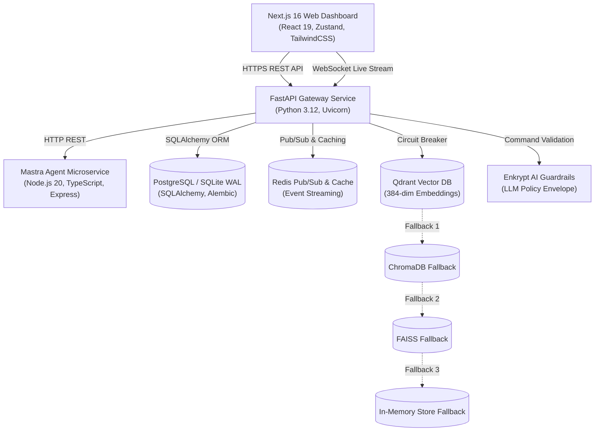
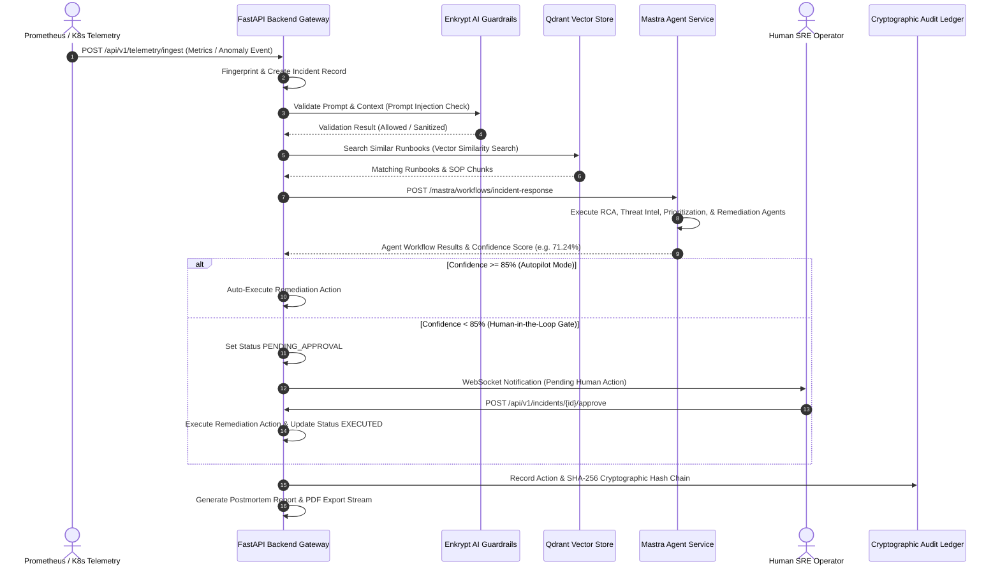

# SentinelFlow AI — System Architecture & Data Flow

SentinelFlow AI maps real-time telemetry inputs to auto-healing cloud actions using multi-stage AI agent workflows, Enkrypt AI safety guardrail policy envelopes, and tamper-evident audit ledgers.

---

## 1. System Component Architecture

---

## 2. Flagship Autonomous Incident Response Sequence

---

## 3. Centralized Secrets & Configuration Architecture

Secrets and environment configurations are managed via a centralized provider pattern (`SecretProvider` in `app.core.secrets`):

- **`EnvSecretProvider`**: Resolves configuration keys from local process environment and `.env` files.
- **`AWSSecretProvider`**: Fetch and cache secrets dynamically from AWS Secrets Manager in production deployments.
- **Encrypted Database Columns**: Sensitive credentials (such as MFA TOTP secrets) are stored using `EncryptedText` SQLAlchemy column types with AES-256 encryption at rest.

---

## 4. Known Limitations & Architectural Trade-offs

1. **Single-Node Qdrant File Lock**: When operating in local embedded file mode (`QDRANT_MODE=local`, `./data/qdrant`), Qdrant locks its directory exclusively to a single process. In multi-worker backend setups, run Qdrant in server/container mode (`QDRANT_MODE=server`).
2. **Mastra Simulation Fallback Flagging**: If upstream LLMs or API keys time out, Mastra workflow steps return fallback responses explicitly flagged with `is_simulated: true` and visible UI warning badges to ensure zero silent mock masquerading.
3. **Database Persistence Fallback**: Defaults to SQLite with WAL mode (`sentinelflow.db`) when external PostgreSQL is unavailable.
4. **Autopilot Governance Gate**: Autopilot remediation enforces an 85% confidence score threshold; actions below 85% transition to `PENDING_APPROVAL` requiring human SRE operator review in the UI.
