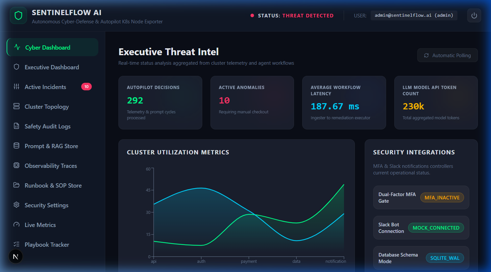
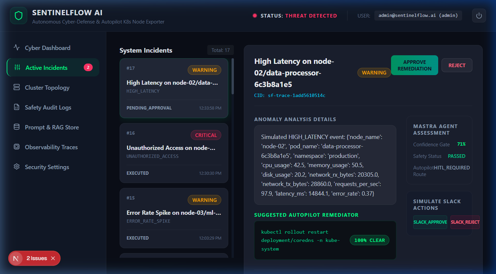
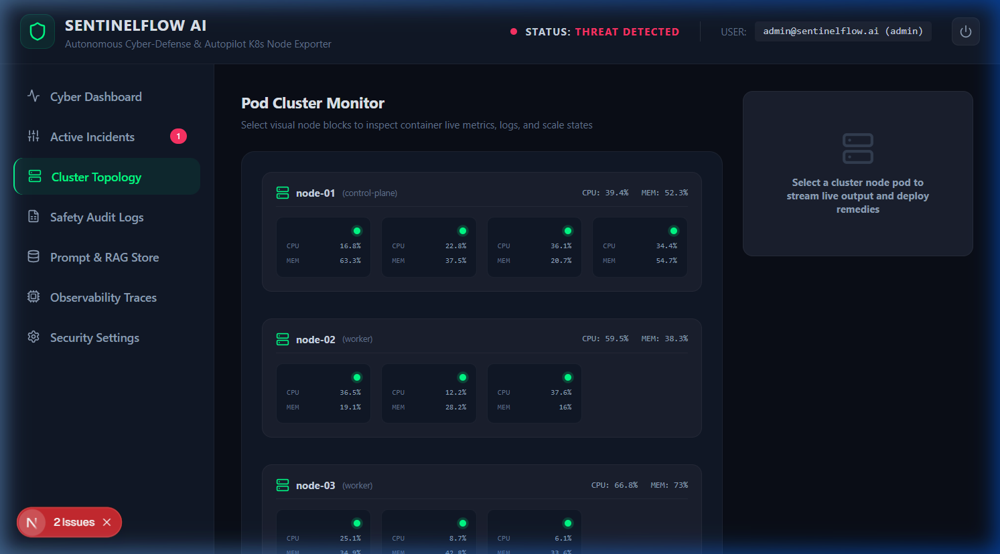

# 🛡️ SentinelFlow AI

> **Autonomous SecOps Incident Response & Post-Mortem Orchestration**  
> *Under the Hood: Mastra Agent Workflows, Enkrypt AI Guardrails, and Tamper-Evident Audit Trails for Cloud & Kubernetes Infrastructures.*


---

## 🚀 Live Demo

### **Deploy in 1-Click**
Click the button below to deploy the entire SentinelFlow AI ecosystem (FastAPI, Next.js, PostgreSQL, Redis, and Qdrant) directly on your Railway project dashboard:

[](https://railway.app/new/template?template=https://github.com/Prajwal20p6/SentinelFlow-AI)

* **Production URL:** `https://frontend-production-3b6e.up.railway.app/`
* **Backend API URL:** `https://backend-production-f51a.up.railway.app/api/v1`
* **Health Check URL:** `https://backend-production-f51a.up.railway.app/api/v1/health`

### 🔑 Demo Credentials
* **Email:** `admin@sentinelflow.ai`
* **Password:** `admin123`
* **MFA Verification Code:** `123456`
* *Note: In the demo control panel, click "INJECT CREDENTIALS" to auto-authenticate.*

---

## 📋 Table of Contents
1. [Project Overview](#1-project-overview)
2. [Problem Statement](#2-problem-statement)
3. [Solution](#3-solution)
4. [Key Features](#4-key-features)
5. [System Architecture](#5-system-architecture)
6. [AI Workflow](#6-ai-workflow)
7. [Mastra Integration](#7-mastra-integration)
8. [Qdrant Integration](#8-qdrant-integration)
9. [Enkrypt AI Integration](#9-enkrypt-ai-integration)
10. [Technology Stack](#10-technology-stack)
11. [Folder Structure](#11-folder-structure)
12. [Installation Guide](#12-installation-guide)
13. [Environment Variables](#13-environment-variables)
14. [Local Setup](#14-local-setup)
15. [Docker Setup](#15-docker-setup)
16. [Running the Backend](#16-running-the-backend)
17. [Running the Frontend](#17-running-the-frontend)
18. [Running Mastra Service](#18-running-mastra-service)
19. [Running Qdrant](#19-running-qdrant)
20. [API Documentation](#20-api-documentation)
21. [Screenshots](#21-screenshots)
22. [Demo](#22-demo)
23. [Security Features](#23-security-features)
24. [Future Improvements](#24-future-improvements)
25. [Contributors](#25-contributors)
26. [License](#26-license)

---

## 1. Project Overview
SentinelFlow AI is a production-ready, self-healing **Autonomous Incident Response & Post-Mortem Generation Platform**. Built for modern distributed Kubernetes and cloud-native systems, SentinelFlow AI ingests telemetry anomalies, invokes a collaborative team of specialized AI agents to analyze threats, orchestrates containment playbooks, and executes rollouts safely under **Enkrypt AI policy envelopes** and cryptographic **Human-in-the-Loop (HITL) approvals**.

## 2. Problem Statement
* 🚨 **Alert Fatigue:** SOC teams are overwhelmed by thousands of raw logs and telemetry metrics.
* 🐢 **High Resolution MTTR:** Manual analysis and correlation across systems takes hours, leaving clusters vulnerable.
* 📉 **Safety Risks in Auto-Remediation:** Executing raw commands in production risks service outages or database destruction.
* 📄 **Manual Audits:** Drafting compliance reports and root-cause analyses wastes precious engineering time.

## 3. Solution
SentinelFlow AI resolves these challenges by introducing:
* **Autonomous Ingestion & Triage:** Directly parses Prometheus metrics and structural system logs.
* **Orchestrated Multi-Agent Reasoning:** Mastra agents collaboratively assess root cause, prioritize severity, analyze threat signatures, and formulate safety-gated remediation tasks.
* **Semantic Runbook Retrieval:** Instant runbook context mapping via Qdrant vector database.
* **Dual-Layer Execution Safety:** Automated verification using both local policies and Enkrypt AI LLM gateways.

## 4. Key Features
* **Multi-agent AI analysis (Mastra):** Collaborates across RCA, Threat Intel, Prioritization, and Remediation roles.
* **Semantic runbook retrieval (Qdrant):** Blazing fast vector matching with multi-database fallback (FAISS, ChromaDB).
* **AI safety guardrails (Enkrypt AI):** Validates prompts and commands against adversarial injection, credentials leakage, and policy violations.
* **Real-time dashboard:** Cyberpunk UI showcasing live metrics, cluster topology nodes, and active incident details.
* **Automated remediation with approval:** Dynamic Human-in-the-Loop gates with one-click playbooks and auto-rollbacks.
* **Production-ready architecture:** Fully Dockerized, instrumented with OpenTelemetry, and backed by DB audit hashing.

---

## 5. System Architecture

```
User Browser (Next.js)
        │
        ├─── HTTP / WebSockets
        ▼
FastAPI Backend (Gateway Layer)
  ├─ Router: Telemetry Ingest
  ├─ Router: Incidents
  ├─ Router: Security (Enkrypt)
  └─ Services: Local Policy Engine, Audit Ledger
        │
        ├─── HTTP ─────┐
        │              ▼
        │         Mastra Service (Node.js)
        │         ├─ RCA Agent
        │         ├─ Threat Intel Agent
        │         ├─ Prioritization Agent
        │         └─ Remediation Agent
        │
        ├─── HTTP ─────┐
        │              ▼
        │         Enkrypt AI API
        │         (https://api.enkryptai.com)
        │
        └─── HTTP ─────┐
                       ▼
                   Qdrant Vector Database
                   (Local Embedded)
                   Collections:
                   ├─ runbooks
                   ├─ shared_memory
                   └─ agent_memory
```

---

## 6. AI Workflow
1. **Telemetry Ingest:** Prom metrics trigger anomaly detection alerts.
2. **Workflow Orchestration (Mastra):** Enters the 8-state incident response state machine.
3. **RCA Analysis:** Evaluates log traces and metrics via the `RootCauseAnalysisAgent`.
4. **Threat Intelligence:** Performs IOC signature lookups (`ThreatIntelAgent`).
5. **Runbook Retrieval:** Queries Qdrant to find matching mitigation playbooks.
6. **Remediation & Enkrypt Validation:** Prior to recommending, passes actions through the Enkrypt AI safety check.
7. **SRE Decision Console:** Exposes the incident for SRE manual execution or automatic execution based on confidence.
8. **Command Execution & Resolution:** The terminal runs the remediation, records container states, and logs output.

---

## 7. Mastra Integration
SentinelFlow AI offloads multi-agent scheduling to a dedicated Mastra microservice. It uses the new Mastra step-flow system to execute the workflow:
* **RCA Agent:** Generates detailed incident logs and root cause mappings.
* **Threat Intel Agent:** Correlates indicators of compromise (IOCs) with threat registries.
* **Prioritization Agent:** Evaluates business impact and assigns SLA limits.
* **Remediation Agent:** Ranks playbook mitigation choices from safest to most aggressive.

Every step yields checkpoint state variables stored directly in the PostgreSQL/SQLite backend database.

---

## 8. Qdrant Integration
Runbook knowledge bases and agent experiences are embedded and searched using Qdrant:
* **Text Embeddings:** Uses the `all-MiniLM-L6-v2` transformer model (yielding a dense 384-dimension vector).
* **Multi-DB Fallback Cascade:** Cascades automatically from Qdrant to FAISS, ChromaDB, and InMemory caches if service nodes time out.
* **Self-Learning Loop:** Successfully resolved incidents are converted into vector vectors and upserted back to Qdrant to improve future recommendations.

---

## 9. Enkrypt AI Integration
SentinelFlow AI integrates the `enkryptai-sdk` as a central security wrapper for all terminal commands:
* **Gated Terminals:** Every direct CLI run or playbook execution evaluates through `EnkryptSafetyService.validate_command`.
* **Guardrail Controls:** Blocks execution of prompt injection, command injection, and critical system deletions (e.g. `rm -rf /` or `kubectl delete namespace default`).
* **Bypass Mitigation:** No command can bypass the Enkrypt AI gateway. Unsafe requests trigger immediate 403 blocks logged in the audit ledger.

---

## 10. Technology Stack
* **Backend:** Python 3.12, FastAPI, SQLAlchemy, Alembic, OpenTelemetry, Prometheus Client
* **Frontend:** React 19, Next.js 15, TailwindCSS, Recharts, Lucide icons
* **AI Orchestration:** Mastra SDK, Node.js, Express, TSX
* **Databases:** Qdrant, PostgreSQL, SQLite, Redis
* **LLMs:** OpenAI GPT-4, Anthropic Claude-3

---

## 11. Folder Structure
```
sentinelflow-ai/
├── README.md (project root)
├── LICENSE (MIT License)
├── .gitignore (complete git patterns)
├── docker-compose.yml
├── .github/
│   ├── ISSUE_TEMPLATE/
│   └── PULL_REQUEST_TEMPLATE.md
├── backend/
│   ├── requirements.txt
│   ├── .env.example
│   ├── app/
│   │   ├── main.py
│   │   ├── api/
│   │   ├── services/
│   │   └── core/
│   └── tests/
├── frontend/
│   ├── package.json
│   └── src/
└── mastra-service/
    ├── package.json
    ├── tsconfig.json
    └── src/
```

---

## 12. Installation Guide
Ensure you have the following installed locally:
- Python 3.12+
- Node.js 20+
- Docker & Docker Compose

Clone the repository:
```bash
git clone https://github.com/Prajwal20p6/SentinelFlow-AI.git
cd SentinelFlow-AI
```

---

## 13. Environment Variables
Copy `.env.example` to `.env` in the root:
```bash
cp .env.example .env
```
Key configurations include:
- `OPENAI_API_KEY`: Your OpenAI API token.
- `ENKRYPTAI_API_KEY`: Your Enkrypt AI account token.
- `LLM_PROVIDER`: Set to `simulation` for mock run mode or `openai` / `anthropic` for production.

---

## 14. Local Setup
You can run the three service groups locally in separate terminal tabs:

### 1. Start the Python Backend
```bash
cd backend
python -m venv venv
venv\Scripts\activate  # On Linux/macOS: source venv/bin/activate
pip install -r requirements.txt
python -m uvicorn app.main:app --reload --port 8000
```

### 2. Start the Mastra Service
```bash
cd mastra-service
npm install
npm run dev
```

### 3. Start the Next.js Frontend
```bash
cd frontend
npm install
npm run dev
```

---

## 15. Docker Setup
To spin up all services together using Docker Compose:
```bash
docker-compose up --build
```
This launches the FastAPI server, Next.js dashboard, Mastra workflow agent service, PostgreSQL database, Redis, and Qdrant.

---

## 16. Running the Backend
To start the Python backend in isolation:
```bash
cd backend
python -m uvicorn app.main:app --reload --port 8000
```
Swagger UI docs will be available at: http://localhost:8000/docs

---

## 17. Running the Frontend
To start the React frontend client in isolation:
```bash
cd frontend
npm run dev
```
The user console will be available at: http://localhost:3000

---

## 18. Running Mastra Service
To launch the Node.js Mastra agent executor:
```bash
cd mastra-service
npm run dev
```
The agent workflows run on: http://localhost:3001

---

## 19. Running Qdrant
Qdrant runs automatically in local SQLite-backed mode. If you prefer running a remote/server instance:
```bash
docker run -p 6333:6333 -p 6334:6334 qdrant/qdrant
```
Change `QDRANT_MODE=server` and `QDRANT_HOST=localhost` in your `.env` configuration.

---

## 20. API Documentation
Detailed interactive API swagger docs are exposed at: http://localhost:8000/docs
Key API groups:
- **Telemetry Ingestion:** `POST /api/v1/telemetry/ingest`
- **Remediation Actions:** `POST /api/v1/incidents/{incident_id}/execute-remediation`
- **Infra Guarded CLI:** `POST /api/v1/infra/execute-command`
- **Audit Verification Ledger:** `GET /api/v1/infra/audit-trail/verify`

---

## 21. Screenshots

### Cyber Security Dashboard


### Incident Resolution Details


### Live Cluster Topology Map


---

## 22. Demo
To trigger a mock threat incident:
1. Open http://localhost:3000/
2. Log in with `admin@sentinelflow.ai` / `admin123`.
3. Open the **Demo Control Panel** drawer on the bottom-left sidebar.
4. Click **Trigger CPU_SPIKE (Payment API Pod)**.
5. In the incident feed, check incident details to see Mastra RCA reasoning and Qdrant matched runbooks.

---

## 23. Security Features
- **Tamper-Evident Ledger:** Audit logs contain SHA-256 hashes chained cryptographically. Modifying database records breaks verification validation.
- **PII Scrubbing Middleware:** Automatically sanitizes IPs, emails, and credentials from telemetry data streams.
- **RBAC Gated APIs:** Restricts direct command executions to authenticated `engineer` and `admin` roles.

---

## 24. Future Improvements
- Integrations with Kubernetes CRDs for actual namespace isolation.
- Multi-cloud API orchestrators (AWS Security Hub, GCP Command Center).
- Custom prompt templates hot reloading.

---

## 25. Contributors
- **Prajwal S** — Lead System Architect & SRE (https://github.com/Prajwal20p6)
- HiDevs Hackathon Team (2026)

---

## 26. License
This project is licensed under the MIT License. See [LICENSE](LICENSE) for details.
