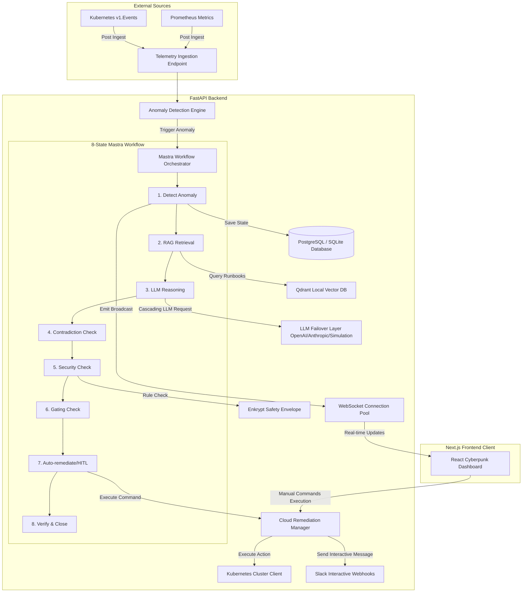

# SentinelFlow AI — System Architecture

This guide describes the modular components and self-healing lifecycle mapping of SentinelFlow AI.

---

## 1. System Topology Overview

The application utilizes a decoupled backend (FastAPI) and frontend (Next.js React dashboard) architecture communicating via REST APIs and WebSockets.

---

## 2. Key Architecture Blocks

1. **API Gateway Middleware**:
   - Rate-limiting checking buckets per client IP.
   - OWASP prompt and query injection filters.
   - Standardized error-handling envelopes.
2. **Mastra-Inspired State Machine**:
   - Durably tracks transaction checkpoints in the database.
   - Evaluates LLM reasoning confidence gates (automatic execution if confidence $\ge$ 80%; human-in-the-loop escalation if below).
3. **Enkrypt AI Safety Envelope**:
   - Validates suggested actions against local regex and block policies.
   - Automatically falls back to manual validation if commands match threat signatures.
4. **Cloud Remediations Router**:
   - Standardizes execution logs in SQL database.
   - Provides inverse command generators for rollback triggers (e.g. scale up has rollback scale down).
5. **WebSocket Session Pool**:
   - Manages horizontal scaling via Redis pub/sub.
   - Buffers offline messages up to 1 hour to prevent client packet loss.
