# Database Schema and Migration Strategy

SentinelFlow AI is backed by a fully normalized database schema mapping user profiles, container telemetry, incident lifecycles, and cryptographic audit records. It implements an event-sourcing model for state transitions, transparent columns encryption, and high-performance indexes.

---

## 1. Entity Relationship (ER) Diagram

```mermaid
erDiagram
    users {
        int id PK
        string email UK
        string hashed_password
        string full_name
        string role
        boolean is_active
        boolean mfa_enabled
        string mfa_secret
        datetime created_at
        datetime updated_at
    }

    roles {
        int id PK
        string name UK
        string description
    }

    permissions {
        int id PK
        string name UK
        string description
    }

    role_permissions {
        int id PK
        int role_id FK
        int permission_id FK
    }

    incidents {
        int id PK
        string correlation_id UK
        string source
        string metric_type
        string severity
        string title
        string description "AES-256 Encrypted"
        string status
        float confidence_score
        text suggested_action
        string assigned_to
        datetime resolved_at
        datetime created_at
        datetime updated_at
    }

    incident_logs {
        int id PK
        int incident_id FK
        string stage
        string message "AES-256 Encrypted"
        text metadata_json
        datetime timestamp
    }

    timeline_events {
        int id PK
        int incident_id FK
        string event_type
        string title
        text description
        string actor
        text decision_rationale
        float confidence_at_step
        float duration_ms
        datetime timestamp
    }

    audit_trails {
        int id PK
        int incident_id FK
        string command_checked "AES-256 Encrypted"
        string status
        float risk_score
        text risk_assessment
        string remediation_action
        string performed_by
        string hash
        string prev_hash
        datetime timestamp
    }

    metric_samples {
        int id PK
        string node_name
        string pod_name
        string namespace
        float cpu_usage
        float memory_usage
        float disk_usage
        float network_rx_bytes
        float network_tx_bytes
        float requests_per_sec
        float latency_ms
        float error_rate
        datetime timestamp
    }

    prompt_templates {
        string id PK
        string name
        text capacity
        text role
        text intent
        text subject
        text premium_response
        text evaluation
        string category
        boolean is_active
        datetime created_at
        datetime updated_at
    }

    ai_observability_traces {
        int id PK
        string correlation_id
        string step_name
        int input_tokens
        int output_tokens
        float latency_ms
        string status
        text error_message
        text metadata_json
        datetime timestamp
    }

    feature_flags {
        int id PK
        string key UK
        boolean value
        string description
        string updated_by
        datetime updated_at
    }

    notification_logs {
        int id PK
        int incident_id FK
        string channel
        string recipient
        text message
        string status
        string response_action
        datetime timestamp
    }

    security_policies {
        int id PK
        string name UK
        string strictness
        boolean is_active
        datetime created_at
        datetime updated_at
    }

    policy_rules {
        int id PK
        int policy_id FK
        string pattern
        string rule_type
        float risk_weight
        datetime created_at
    }

    mastra_workflow_states {
        int id PK
        string workflow_name
        string correlation_id UK
        string current_state
        text context_data_json
        boolean is_completed
        datetime created_at
        datetime updated_at
    }

    mastra_workflow_steps {
        int id PK
        int workflow_state_id FK
        string step_name
        string status
        datetime started_at
        datetime ended_at
        text error_message
    }

    qdrant_collection_metadata {
        int id PK
        string collection_name UK
        int vector_dimension
        string distance_metric
        datetime created_at
    }

    rag_runbook_memories {
        int id PK
        string runbook_title
        text content_summary
        string vector_payload_id
        datetime created_at
    }

    cloud_provider_configs {
        int id PK
        string provider_name
        string credentials_mask
        string region
        boolean is_active
        datetime created_at
    }

    kubernetes_cluster_infos {
        int id PK
        string cluster_name UK
        string api_endpoint
        text namespaces_list
        string status
        datetime created_at
    }

    remediation_executions {
        int id PK
        int incident_id FK
        string command "AES-256 Encrypted"
        string execution_status
        text console_output
        string executed_by
        datetime started_at
        datetime finished_at
    }

    incident_comments {
        int id PK
        int incident_id FK
        string author
        text content
        datetime created_at
    }

    role_permissions ||--o{ roles : role_id
    role_permissions ||--o{ permissions : permission_id
    incident_logs }o--|| incidents : incident_id
    timeline_events }o--|| incidents : incident_id
    audit_trails }o--|| incidents : incident_id
    notification_logs }o--|| incidents : incident_id
    remediation_executions }o--|| incidents : incident_id
    incident_comments }o--|| incidents : incident_id
    policy_rules }o--|| security_policies : policy_id
    mastra_workflow_steps }o--|| mastra_workflow_states : workflow_state_id
```

---

## 2. Table Catalog (23 Tables)

1. **`users`**: System access credentials and MFA configuration.
2. **`roles`**: RBAC role groups (e.g. `admin`, `engineer`, `viewer`).
3. **`permissions`**: Fine-grained permissions (e.g. `execute:command`).
4. **`role_permissions`**: Many-to-many associations mapping roles to permissions.
5. **`incidents`**: Central security alerts generated from anomalies.
6. **`incident_logs`**: Process tracing metrics recorded at each stage.
7. **`timeline_events`**: Event-sourced decision trails mapped to timestamp logs.
8. **`audit_trails`**: Immutable logs matching hash outputs for audit verifications.
9. **`metric_samples`**: Telemetry metrics (CPU, RAM, Disk, Error Rate).
10. **`prompt_templates`**: CRISPE structural inputs seeded in system configs.
11. **`ai_observability_traces`**: Observability steps logging token usage and latencies.
12. **`feature_flags`**: Run-time toggles managing engine features.
13. **`notification_logs`**: Logs tracking outgoing notification payloads and states.
14. **`security_policies`**: Strictness configuration layers for safety assessing.
15. **`policy_rules`**: Blocked and allowed patterns used by the safety envelope.
16. **`mastra_workflow_states`**: Active workflows, steps, and context data.
17. **`mastra_workflow_steps`**: Details tracking execution states of workflow tasks.
18. **`qdrant_collection_metadata`**: Dimension mapping statistics.
19. **`rag_runbook_memories`**: Locally archived references mapping semantic runbooks.
20. **`cloud_provider_configs`**: Subnet configs and region overrides for remediation.
21. **`kubernetes_cluster_infos`**: Managed endpoints listing API metrics.
22. **`remediation_executions`**: Console returns and code parameters of commands run.
23. **`incident_comments`**: User-submitted comments and troubleshooting notes associated with security incidents.

---

## 3. Index Strategy and Query Optimization

- **Compound Index on Incidents**: `Index("ix_incidents_status_severity", "status", "severity")` optimizes active queue fetch performance.
- **Unique Indexes on Correlation Identifiers**: Speeds up trace tracking queries across telemetry and incident logs.
- **Partitioning Strategy (PostgreSQL Reference)**: For production scale, the `metric_samples` and `ai_observability_traces` tables should be partitioned on the `timestamp` column using range partitions (e.g. monthly).
