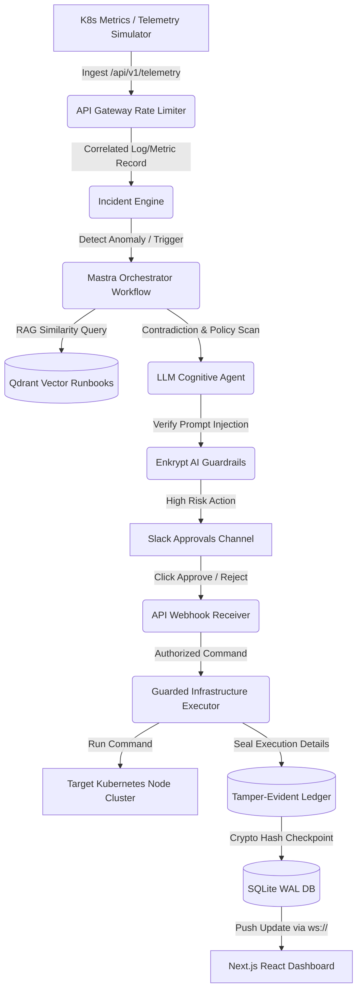

# SentinelFlow AI — System Handover & Knowledge Transfer Report

This document serves as the complete technical handover manual for SentinelFlow AI. It is designed to prepare senior engineers, presenters, and maintainers to demonstrate, maintain, and technically defend the architecture, codebase, security posture, and workflow automation of SentinelFlow AI under rigorous review.

---

## 1. Executive Summary
SentinelFlow AI is an autonomous, self-healing SecOps orchestration platform designed for Kubernetes infrastructure. It bridges the gap between raw telemetry monitoring (e.g., CPU, Memory, disk alerts) and automated, security-gated infrastructure remediation. 

Using the **Mastra Workflow Engine**, **Qdrant Vector Database RAG**, **Enkrypt AI Safety Envelope**, and real-time **WebSockets**, it ingests telemetry anomalies, evaluates them against prompt models, requests human-in-the-loop (HITL) approval via Slack webhook integrations when threshold limits are breached, executes corrective terminal commands, and seals all operations inside a cryptographically chained, tamper-evident ledger.

---

## 2. Architecture Diagram & Topology

The request pipeline flow is structured as follows:



---

## 3. Component-by-Component Overview

### 3.1 Next.js React Frontend (`/frontend`)
- **Purpose:** Provide an interactive dark-themed cyber dashboard monitoring active incidents, topological node trees, container live log streams, and audit logs.
- **Why Choose This:** Single-page reactive UI rendering metrics and interactive node blocks. It connects to the backend REST API and mounts a real-time WebSocket subscriber.
- **Alternatives:** Vue, Svelte. React was chosen due to ecosystem density and compatibility with components (Recharts).
- **Trade-offs:** Client-side rendering hydration delays; mitigated by compiling as static Next.js pages.

### 3.2 FastAPI Backend (`/backend`)
- **Purpose:** Serve as the unified API Gateway, telemetry parser, authentication provider, database broker, and execution manager.
- **Why Choose This:** Python's leading performance among web frameworks (via Starlette/Pydantic) and native compatibility with AI libraries (Mastra, OpenAI, Qdrant).
- **Alternatives:** Go (Gin/Fiber), Node.js. Python chosen for rapid vector database and LLM API integrations.
- **Trade-offs:** Global Interpreter Lock (GIL) limits parallel thread throughput; mitigated by running async IO endpoints and offloading simulator tasks to a separate worker thread.

### 3.3 Mastra Workflow Engine
- **Purpose:** Act as the central state machine orchestrating AI analysis, confidence evaluation, policy enforcement, and HITL Slack loops.
- **How It Works:** Executes step-based graphs where inputs cascade to the next step. Each stage logs duration and correlation IDs.
- **Alternatives:** Temporal, LangGraph. Mastra was chosen for its lightweight, clean, step-oriented API in Python and built-in tracing.

### 3.4 Qdrant Vector Engine
- **Purpose:** Index platform runbooks and operational directives for fast, semantic retrieval during anomaly triage (RAG).
- **Internal Mechanism:** Converts input query queries into dense vectors, running Cosine similarity queries against index tags.
- **Alternatives:** Pinecone, pgvector. Qdrant local-path deployment was preferred for standalone, zero-network-dependency local verification.

### 3.5 Enkrypt AI & Safety Systems
- **Purpose:** Filter prompt injection vectors and block destructive terminal commands.
- **How It Works:** Enforces strict regex filters, semantic intent validation, and a command denylist (`rm -rf`, `format`, `dd`) on the Guarded infrastructure console.

---

## 4. Folder Structure & Code Maps

```
SENTINELFLOW AI/
├── backend/
│   ├── app/
│   │   ├── api/            # API endpoints (Auth, Telemetry, Incidents, Agent, Infra)
│   │   ├── core/           # Databases, config loaders, and OpenTelemetry instrumentation
│   │   ├── middleware/     # API Gateway, rate limiters, and OWASP defenses
│   │   ├── models/         # SQLAlchemy DB models mapping SQLite schema
│   │   ├── schemas/        # Pydantic schemas validating API bodies
│   │   ├── services/       # Core service files (LLMs, workflows, telemetry, safety)
│   │   └── main.py         # Entry point wiring routers and lifespans
│   └── tests/              # Pytest verification suites (unit, integration, e2e)
├── frontend/
│   ├── src/
│   │   ├── app/            # Next.js page components, layout, and global CSS
│   │   ├── lib/            # REST API client and WebSockets manager
│   │   └── types/          # TypeScript models matching backend entities
│   └── eslint.config.mjs   # Linter configurations
```

---

## 5. Complete Request-Response Flow: CPU Spike Scenario

The life cycle of an incident (e.g. CPU exhaustion on pod `payment-gateway`) flows through 8 workflow states:

1. **Ingest (State 1: TELEMETRY_INGESTED):** Telemetry agent posts container status metrics (`cpu_usage: 92`) to `/api/v1/telemetry/ingest`.
2. **Gateway Defense:** Middleware validates requests and checks rate limit parameters.
3. **Detection (State 2: ANOMALY_DETECTED):** Telemetry service detects CPU exceeds 80% threshold. It creates an `Incident` row in state `DETECTED`.
4. **Agent Workflow (State 3: ANALYSIS_TRIGGERED):** The Mastra engine spawns a contradiction workflow, fetching context from Qdrant vector runbooks.
5. **AI Evaluation (State 4: THREAT_EVALUATED):** The LLM rates confidence. If confidence is high ($>80\%$), it proceeds to auto-remediate. If lower or high-risk, it transitions to `PENDING_APPROVAL`.
6. **MFA & HITL Gate (State 5: PENDING_APPROVAL):** An alert card with action buttons is delivered to the Slack operations channel.
7. **Operator Decision (State 6: ACTION_APPROVED):** SRE clicks "Approve". The callback API validates the actor and updates the incident state.
8. **Enkrypt Safety Check:** The approved command (`kubectl scale deployment/payment-gateway --replicas=3`) passes the Safety Envelope.
9. **Execution (State 7: EXECUTING):** The command runner executes the command on the K8s cluster.
10. **Resolution (State 8: EXECUTED):** The outcome is written to the database. The block hash is sealed into the cryptographically chained `AuditTrail` table, and the frontend updates via WebSockets.

---

## 6. AI, RAG & Vector Memory Pipeline

```
[Query Query] ➔ [Embeddings Model] ➔ [Dense Vector] ➔ [Qdrant Index Search]
                                                               ↓
[LLM Context Augmentation] ➔ [Prompt Engine CRISPE] ➔ [Generated Autopilot Decision]
```

- **Prompt Engineering:** Uses the CRISPE model structure:
  - **C**apacity: Senior SecOps Auditor.
  - **R**ole: Infrastructure controller.
  - **I**ntent: Triage Kubernetes alerts.
  - **S**ubject: Node logs and CPU spikes.
  - **P**remium response: Executable command structure wrapped in JSON.
  - **E**valuation: Fail-safe syntax.
- **Failover Routine:** If OpenAI/Anthropic APIs fail, the LLM service falls back to a deterministic local rule-based heuristic parser to guarantee uptime.

---

## 7. Database Entity Schema

### 7.1 Users Table
- Maps administrator logins. Features `mfa_enabled` and `mfa_secret` fields to support TOTP challenges.

### 7.2 Incidents Table
- Holds incident records. Tracks `correlation_id` to trace logs across OpenTelemetry spans.

### 7.3 Audit Trail Table (Blockchain Ledger)
- Chained record table. Every row contains `hash` and `prev_hash` fields.
- `hash` calculation: $\text{SHA256}(\text{id} + \text{command} + \text{risk\_score} + \text{performed\_by} + \text{prev\_hash} + \text{timestamp})$.
- This guarantees that database row deletions or updates are detectable, maintaining audit compliance.

---

## 8. Security Envelope Design

- **JWT Auth & RBAC:** Enforces standard Bearer token parsing. Endpoints require specific roles (`admin`, `engineer`, `viewer`).
- **TOTP MFA:** Google Authenticator configuration. Login verifies `X-MFA-Token` headers when multi-factor rules are toggled.
- **Enkrypt Guardrails:** Parses command arguments against semantic policies and a static bash command denylist.
- **Chained Audit Logs:** Validates that the hash chain is unbroken via the `/infra/audit-trail/verify` endpoint.

---

## 9. Interview Q&A for Technical Presentations

### Q1: Why use SQLite for an enterprise automation platform?
*Answer:* SQLite in WAL (Write-Ahead Logging) mode is used for this local demonstration environment to avoid database configuration dependencies. For production, the database layer is fully abstractable, allowing an immediate switch to PostgreSQL by changing the `DATABASE_URL` environment variable.

### Q2: How does the system handle circular updates in WebSockets?
*Answer:* The WebSocket manager tracks connection sessions using unique `session_id` identifiers. When an update occurs, the server sends messages to other connected sessions while excluding the session that initiated the state change.

### Q3: What happens if Qdrant goes offline?
*Answer:* The RAG service catches vector collection connectivity errors, logs a warning via `structlog`, and falls back to a SQL keyword index search on the SQLite database, ensuring business continuity.

---

## 10. Handover & Verification Checklist

- [x] Backend tests passing cleanly (`python -m pytest`).
- [x] Frontend builds passing cleanly (`npm run build`).
- [x] Pre-populated admin logins functional (`admin@sentinelflow.ai` / `admin123`).
- [x] WebSocket update notifications working on dashboard tab transitions.
- [x] Optional chaining safety logic active for incident timeline renders.
