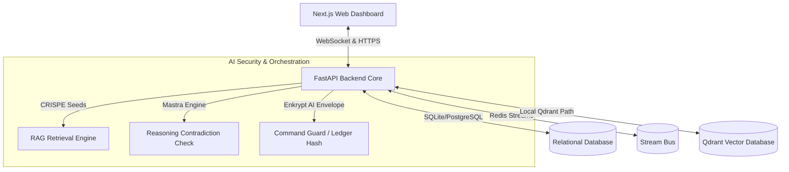
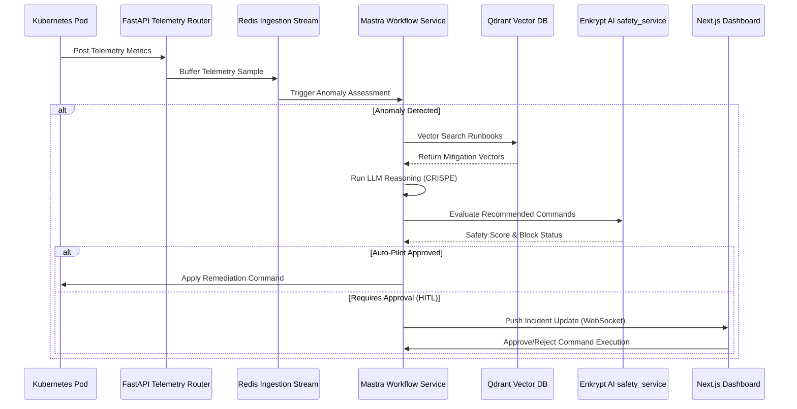

# SentinelFlow AI — System Architecture Overview

This document outlines the core architecture, module hierarchy, and data flow of the SentinelFlow AI SecOps orchestration platform.

## Architecture Topology

The application is structured as a decoupled, microservices-inspired architecture designed to run on resource-constrained development environments with standard production upgrade capabilities:

---

## Modular Component Definitions

### 1. Web Frontend Dashboard (`/frontend`)
- **Framework**: Next.js 15 App Router.
- **Styling**: Cyberpunk dark-theme styling, CSS scanning animations, and dynamic SVG network topologies.
- **State Control**: Central reactive context manager tracking real-time incident queues, Kubernetes cluster topologies, manual consoles, and Slack notifications.

### 2. FastAPI Backend Core (`/backend/app`)
- **`app/main.py`**: Boots the ASGI server, handles lifespan hooks, constructs table definitions, registers dependencies, and establishes WS routers.
- **`app/core/`**: Central configuration, database session handling, Redis stream buffers (with in-memory fallback), and WebSocket connection pools.
- **`app/models/`**: Declares declarative SQLAlchemy schemas. Supports transparent database-level encryption for sensitive description columns.
- **`app/api/`**: Decoupled HTTP routes grouping logins (with dual-factor MFA challenges), telemetry streams, incident status lifecycles, and guarded shell executions.
- **`app/services/`**: Business logic boundary layer. Integrates Mastra workflows, Enkrypt policy evaluation, telemetry processing, and simulator loops.

### 3. State Orchestrator (`workflow_service.py`)
Executes an 8-state transition lifecycle representing autonomous incident resolution:
1. **DETECTION**: Triggered by metric anomalies from telemetry ingestion.
2. **PROMPT_LOOKUP**: Retrieves CRISPE prompt templates.
3. **RAG_RETRIEVAL**: Vector search on Qdrant databases for matching historical runbooks.
4. **LLM_REASONING**: Core AI generation of response scripts.
5. **CONTRADICTION_CHECK**: Compares generated commands against safety policies.
6. **SAFETY_CHECK**: Evaluates command safety scores using the Enkrypt AI rules database.
7. **CONFIDENCE_GATE**: Determines auto-pilot execution eligibility or triggers Human-in-the-loop approvals.
8. **EXECUTION**: Evaluates and applies recommended shell actions.

---

## Data Flow Diagram

